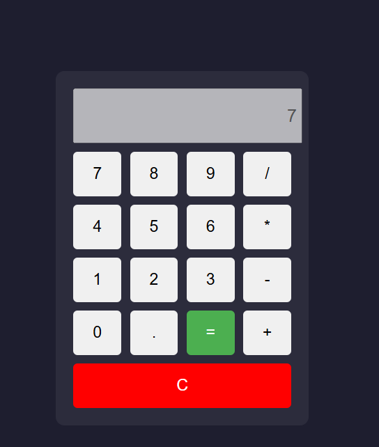

# 🧮 Calculatrice JavaScript

Une calculatrice simple et fonctionnelle développée en **HTML, CSS et JavaScript vanilla**.  
Ce projet permet de réaliser des opérations mathématiques de base directement dans le navigateur.



---

## 🚀 Fonctionnalités

- Addition ➕
- Soustraction ➖
- Multiplication ✖️
- Division ➗
- Effacer l’écran (C)
- Affichage en temps réel des saisies
- Gestion des erreurs de calcul

---

## 🛠️ Technologies utilisées

- HTML5 (structure)
- CSS3 (mise en forme)
- JavaScript (logique et interactions DOM)

---

## 📁 Structure du projet


/calculator-project
│
├── index.html # Structure principale
├── style.css # Styles de la calculatrice
└── script.js # Logique JavaScript


---

## ▶️ Comment exécuter le projet

1. Clone le repository :
```bash
git clone https://github.com/ton-utilisateur/calculator-js.git
Ouvre le dossier :
cd calculator-js
Lance le projet :
Ouvre simplement index.html dans ton navigateur
