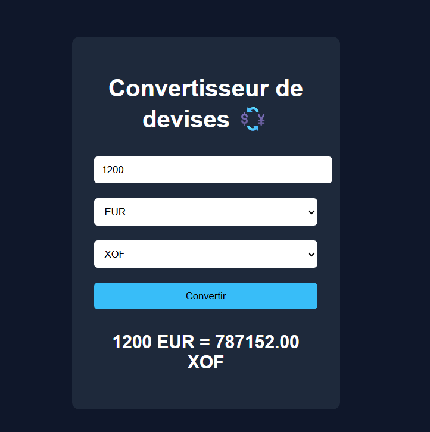

📄 README — Convertisseur de Devises 💱
📌 Description

Le Convertisseur de Devises est une application web développée en JavaScript permettant de convertir un montant d’une devise à une autre en temps réel grâce à une API de taux de change.

Ce projet a pour objectif de mettre en pratique :

    la manipulation du DOM
    les requêtes API (fetch)
    l’asynchronisme (async/await)
    la gestion des événements utilisateur

🚀 Fonctionnalités
    💰 Saisie d’un montant
    🌍 Sélection de la devise d’origine
    🔁 Sélection de la devise cible
    ⚡ Conversion en temps réel via API
    📊 Affichage du résultat instantané

🛠️ Technologies utilisées
    HTML5
    CSS3
    JavaScript (Vanilla JS)
    API : ExchangeRate API

📂 Structure du projet
    currency-converter/
    │── index.html
    │── style.css
    │── script.js

⚙️ Installation & utilisation
    Cloner le projet :
    git clone https://github.com/ton-username/currency-converter.git
    Ouvrir le fichier :
    index.html

👉 Aucun serveur nécessaire (projet 100% frontend)

🔌 API utilisée
    Endpoint :
    https://api.exchangerate-api.com/v4/latest/{BASE}
    Exemple :
    https://api.exchangerate-api.com/v4/latest/EUR

🔥 Améliorations possibles
    🔄 Bouton pour inverser les devises
    ⚡ Conversion automatique sans bouton
    📜 Historique des conversions
    💾 Sauvegarde via localStorage
    🌐 Ajout des drapeaux des pays
    🎨 Amélioration UI/UX (animations, design moderne)

🧠 Objectifs pédagogiques

Ce projet permet de comprendre :

    le fonctionnement des API REST
    la gestion des données JSON
    l’interaction utilisateur via le DOM
    les bonnes pratiques en JavaScript

📄 Licence

Projet libre d’utilisation à des fins pédagogiques.
