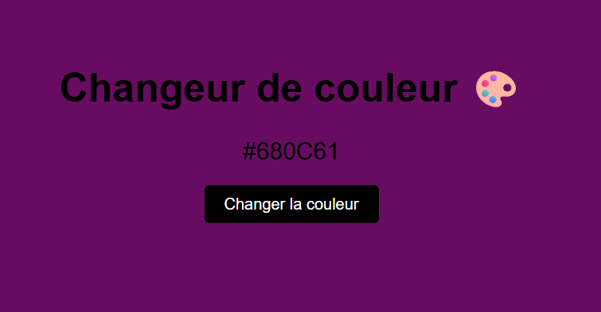

# 🎨 Changeur de Couleur Aléatoire

Une application simple en JavaScript qui permet de changer dynamiquement la couleur de fond de la page avec une couleur aléatoire.

---

## 🚀 Fonctionnalités

* Génération d'une couleur aléatoire en format HEX
* Changement instantané du background
* Affichage du code couleur sélectionné
* Interface simple et interactive

---

## 🛠️ Technologies utilisées

* HTML5
* CSS3
* JavaScript (Vanilla JS)

---

## 📂 Structure du projet

```
/project-folder
│── index.html
│── style.css
│── script.js
```

---

## ⚙️ Installation et utilisation

1. Cloner le projet :

```
git clone https://github.com/ton-username/changeur-couleur.git
```

2. Ouvrir le fichier `index.html` dans un navigateur

---

## 💡 Comment ça fonctionne ?

* Une fonction JavaScript génère une couleur aléatoire en HEX
* Un événement `click` est attaché au bouton
* À chaque clic :

  * La couleur de fond change
  * Le code couleur est affiché à l’écran

---

## 📸 Aperçu



---

## 🚀 Améliorations possibles

* Copier automatiquement la couleur dans le presse-papier
* Ajouter un mode RGB / HSL
* Sauvegarder la dernière couleur avec localStorage
* Ajouter des animations ou transitions avancées
* Générer une palette de couleurs

---

## 🎯 Objectif pédagogique

Ce projet permet de pratiquer :

* Manipulation du DOM
* Gestion des événements
* Génération de valeurs aléatoires
* Interaction utilisateur

---

## 📄 Licence

Ce projet est libre d’utilisation.
