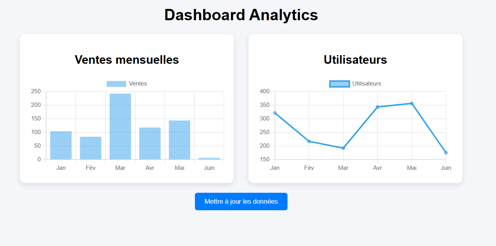

# 📊 Dashboard Analytics - JavaScript

## 🚀 Description

Ce projet est un **dashboard d’analyse interactif** développé en JavaScript pur, permettant de visualiser des données dynamiques à l’aide de graphiques.

L’objectif est de simuler un outil de suivi de performance (ventes, utilisateurs) avec une interface simple et interactive.



---

## 🎯 Objectifs du projet

* Manipuler le DOM avec JavaScript
* Intégrer une librairie de visualisation (**Chart.js**)
* Gérer des données dynamiques
* Mettre à jour une interface en temps réel
* Structurer un projet frontend simple

---

## 🛠️ Technologies utilisées

* HTML5
* CSS3
* JavaScript (Vanilla JS)
* Chart.js

---

## 📸 Aperçu

* Graphique des ventes mensuelles (bar chart)
* Graphique des utilisateurs (line chart)
* Bouton de mise à jour des données

---

## ⚙️ Fonctionnalités

* 📊 Affichage de graphiques dynamiques
* 🔄 Mise à jour des données en temps réel
* 🎲 Génération de données aléatoires
* 💡 Interface simple et lisible

---

## 📁 Structure du projet

```
/dashboard-js
 ├── index.html
 ├── style.css
 └── script.js
```

---

## ▶️ Installation et utilisation

1. Cloner le projet :

```
git clone https://github.com/ton-username/dashboard-js.git
```

2. Ouvrir le fichier `index.html` dans un navigateur

---

## 📈 Améliorations possibles

* Ajouter des filtres (par date, catégorie…)
* Connecter une API réelle (météo, finance, etc.)
* Ajouter d'autres types de graphiques
* Implémenter un mode sombre
* Rendre le design responsive

---

## 🧠 Ce que j’ai appris

* Utilisation de Chart.js pour la data visualisation
* Manipulation du DOM
* Gestion d’événements en JavaScript
* Structuration d’un mini projet frontend

---

## 📌 Auteur

Projet réalisé dans le cadre d’un entraînement en JavaScript.

---

## ⭐️ Feedback

N’hésite pas à donner un ⭐️ si le projet t’a plu !
