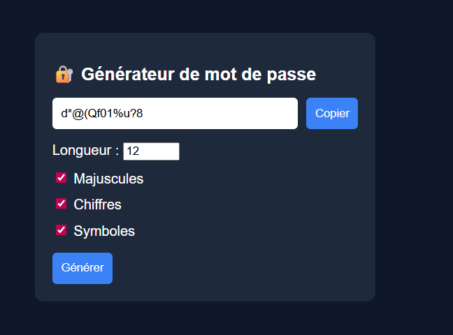

🔐 Générateur de mot de passe

Une application web simple en JavaScript permettant de générer des mots de passe sécurisés et personnalisables.

🚀 Fonctionnalités
    Génération de mots de passe aléatoires
    Choix de la longueur du mot de passe
    Inclusion optionnelle de :
    Majuscules
    Chiffres
    Symboles
    Copie du mot de passe en un clic

🛠️ Technologies utilisées
    HTML5
    CSS3
    JavaScript (Vanilla JS)

📸 Aperçu

📂 Structure du projet
    📁 password-generator
    ├── index.html
    ├── style.css
    └── script.js

⚙️ Installation & utilisation
Clone le repository :
git clone https://github.com/ton-username/password-generator.git
Accède au dossier :
cd password-generator
Ouvre le fichier index.html dans ton navigateur

🧠 Logique du projet

Le générateur fonctionne en :

    Créant un ensemble de caractères en fonction des options sélectionnées
    Utilisant Math.random() pour sélectionner des caractères aléatoires
    Construisant le mot de passe caractère par caractère
    Affichant le résultat dans un champ input

🔒 Améliorations possibles
    Indicateur de force du mot de passe
    Barre de progression visuelle
    Génération automatique en temps réel
    Ajout de minuscules obligatoires (actuellement toujours incluses)
    Refactorisation en modules ES6

📌 Objectif du projet

Ce projet a été réalisé pour :

    Pratiquer la manipulation du DOM
    Comprendre la gestion des événements en JavaScript
    Travailler avec des chaînes de caractères et des fonctions aléatoires
