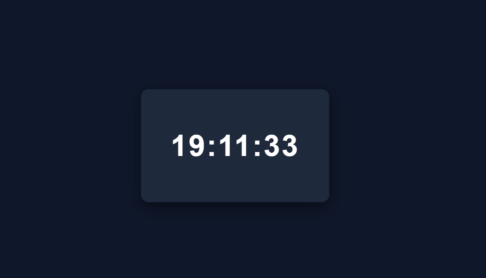

# ⏰ Horloge Digitale en JavaScript

Une horloge digitale simple développée en **HTML, CSS et JavaScript** qui affiche l’heure en temps réel.

---

## 🚀 Aperçu

Cette application affiche l’heure actuelle (heures, minutes, secondes) et se met à jour automatiquement chaque seconde.

---

## 🛠️ Technologies utilisées

    * HTML5
    * CSS3
    * JavaScript (Vanilla JS)

---

## 📂 Structure du projet

```
    /horloge-js
    ├── index.html
    ├── style.css
    └── script.js
```

---

## ⚙️ Installation

    1. Clone le projet :

    ```
    git clone https://github.com/ton-username/horloge-js.git
    ```

    2. Ouvre le fichier `index.html` dans ton navigateur.

---

## 💡 Fonctionnement

    * Utilisation de `Date()` pour récupérer l’heure actuelle
    * Mise à jour dynamique grâce à `setInterval()`
    * Formatage de l’heure avec ajout de zéros (ex : 09:05:02)

---

## ✨ Fonctionnalités

    * ⏱️ Affichage de l’heure en temps réel
    * 🔄 Mise à jour automatique chaque seconde
    * 🎨 Interface simple et moderne

---

## 🔥 Améliorations possibles

    * Ajouter le format 12h / 24h
    * Afficher la date complète
    * Ajouter un mode sombre / clair
    * Ajouter des animations (clignotement, transitions)
    * Adapter le design pour mobile (responsive)

---

## 📸 Capture d’écran



