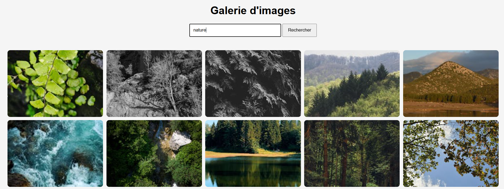

📸 Galerie d’images (API Pexels)

Une application web simple en JavaScript permettant de rechercher et afficher des images via une API externe.

🚀 Objectif du projet

Ce projet a pour but de :
    Apprendre à utiliser une API REST
    Manipuler le DOM en JavaScript
    Gérer des événements utilisateur
    Structurer un projet frontend simple (HTML / CSS / JS)

🛠️ Technologies utilisées
    HTML5
    CSS3
    JavaScript (Vanilla JS)
    API Pexels

⚙️ Fonctionnalités
    🔍 Recherche d’images par mot-clé
    🖼️ Affichage dynamique des images
    ⌨️ Recherche via bouton ou touche "Entrée"
    🎨 Interface simple et responsive

📂 Structure du projet
    /project
    │── index.html
    │── style.css
    │── script.js

🔑 Configuration
    1. Obtenir une clé API
    Créer un compte sur Pexels
    Récupérer votre API Key
    2. Ajouter la clé dans le code

    Dans script.js :
    const API_KEY = "VOTRE_CLE_API_ICI";

▶️ Lancer le projet
    Télécharger ou cloner le projet
    Ouvrir index.html dans un navigateur
    Entrer un mot-clé (ex: "nature", "tech", "cars")
    Cliquer sur "Rechercher"

🧠 Exemple de fonctionnement
const url = `https://api.pexels.com/v1/search?query=${query}&per_page=12`;

const response = await fetch(url, {
  headers: {
    Authorization: API_KEY
  }
});

🔥 Améliorations possibles
    Ajouter une pagination
    Implémenter un scroll infini
    Ajouter un loader (chargement)
    Afficher les informations du photographe
    Ajouter un bouton "Voir l’image originale"
    Améliorer le design (animations, hover, UI moderne)

🎯 Compétences acquises
    Utilisation de fetch()
    Gestion des promesses avec async/await
    Manipulation du DOM
    Intégration d’une API externe
    Structuration d’un mini projet frontend

📌 Idée d’évolution

Transformer ce projet en :

    🔥 clone de Pinterest
    📱 application mobile (React Native)
    🌐 projet portfolio professionnel

👨‍💻 Auteur

Projet réalisé dans le cadre d’apprentissage JavaScript.