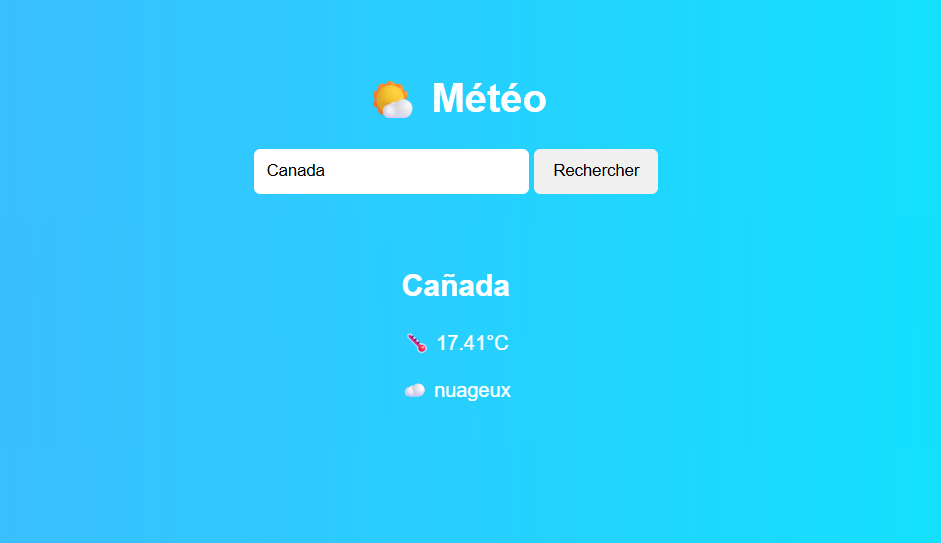

🌤️ App Météo JavaScript

Une application web simple qui permet de rechercher la météo d’une ville en temps réel grâce à une API.

📌 Fonctionnalités
    🔍 Recherche d’une ville
    🌡️ Affichage de la température
    ☁️ Description météo (ex : nuageux, ensoleillé…)
    ⚡ Mise à jour en temps réel
    🚫 Gestion des erreurs (ville introuvable)

🛠️ Technologies utilisées
    HTML5 → structure
    CSS3 → design
    JavaScript (Vanilla) → logique
    API REST → récupération des données météo via OpenWeatherMap

📁 Structure du projet
    /meteo-app
    ├── index.html
    ├── style.css
    └── script.js

🚀 Installation & utilisation
1. Cloner le projet
git clone https://github.com/ton-username/meteo-app.git

2. Ajouter ta clé API

Va sur OpenWeatherMap
    Crée un compte et récupère ta clé API.

    Dans script.js, remplace :

    const apiKey = "TA_CLE_API_ICI";

3. Lancer le projet

Ouvre simplement index.html dans ton navigateur.

⚙️ Fonctionnement
    L’utilisateur entre une ville
    JavaScript envoie une requête via fetch à l’API
    L’API retourne les données météo en JSON
    Les données sont affichées dynamiquement dans le DOM

📷 Aperçu

🔧 Améliorations possibles
    🎯 Recherche avec la touche Entrée
    📍 Géolocalisation automatique
    🖼️ Icônes météo dynamiques
    🌈 Changement de fond selon la météo
    💾 Sauvegarde de la dernière recherche (localStorage)
    📅 Prévisions sur plusieurs jours

❗ Problèmes courants
    Clé API invalide ou expirée
    Mauvaise orthographe de la ville
    Limite de requêtes API atteinte

📚 Objectifs pédagogiques

Ce projet permet de comprendre :

    fetch et les appels API
    async / await
    Manipulation du DOM
    Gestion des événements
    Traitement de données JSON