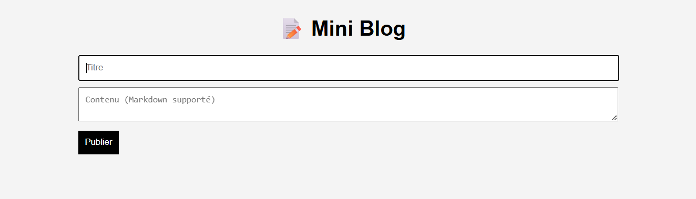

# 📝 Mini Blog JavaScript (Sans Backend)

## 🚀 Description

Mini application de blog développée en **JavaScript vanilla** permettant de créer, afficher et supprimer des articles directement depuis le navigateur, sans backend.

Les données sont persistées grâce à **localStorage**, ce qui simule un comportement d'application réelle côté frontend.

---

## 🎯 Objectifs du projet

* Pratiquer la manipulation du **DOM**
* Implémenter un **CRUD complet** (Create, Read, Delete)
* Comprendre le fonctionnement du **localStorage**
* Structurer un projet JavaScript simple mais réaliste
* Ajouter un support basique du **Markdown**

---

## 🧩 Fonctionnalités

* ➕ Ajouter un article (titre + contenu)
* 📖 Afficher la liste des articles
* ❌ Supprimer un article
* 💾 Sauvegarde automatique dans le navigateur
* ✍️ Support Markdown basique :

  * `**gras**`
  * `*italique*`

---

## 🏗️ Structure du projet

```
mini-blog/
│── index.html
│── style.css
│── app.js
```

---

## ⚙️ Installation & utilisation

1. Cloner le projet :

```bash
git clone https://github.com/ton-username/mini-blog-js.git
```

2. Ouvrir le fichier :

```
index.html
```

👉 Aucun serveur requis — fonctionne directement dans le navigateur.

---

## 🧠 Logique principale

* Les articles sont stockés sous forme de tableau dans `localStorage`
* Chaque action (ajout/suppression) met à jour le stockage
* Le DOM est re-render à chaque modification

---

## 🔑 Fonctions clés

* `getPosts()` → récupérer les articles
* `savePosts()` → sauvegarder dans le localStorage
* `displayPosts()` → afficher les articles
* `deletePost(index)` → supprimer un article
* `parseMarkdown(text)` → interpréter le Markdown

---

## 📸 Aperçu



---

## 🚀 Améliorations possibles

* ✏️ Édition des articles
* 📅 Ajout de date
* 🔍 Barre de recherche
* ❤️ Système de likes
* 🗂️ Catégories / tags
* 🌐 Connexion à une API backend (Node.js / Firebase)

---

## 🧑‍💻 Technologies utilisées

* HTML5
* CSS3
* JavaScript (Vanilla)
* localStorage API

---

## 📌 Pourquoi ce projet ?

Ce projet est idéal pour :

* Débutants souhaitant pratiquer JavaScript
* Construire un projet concret à montrer sur GitHub
* Comprendre les bases des applications frontend

---

## ⭐ N'hésite pas à donner une étoile si le projet t'a aidé !
