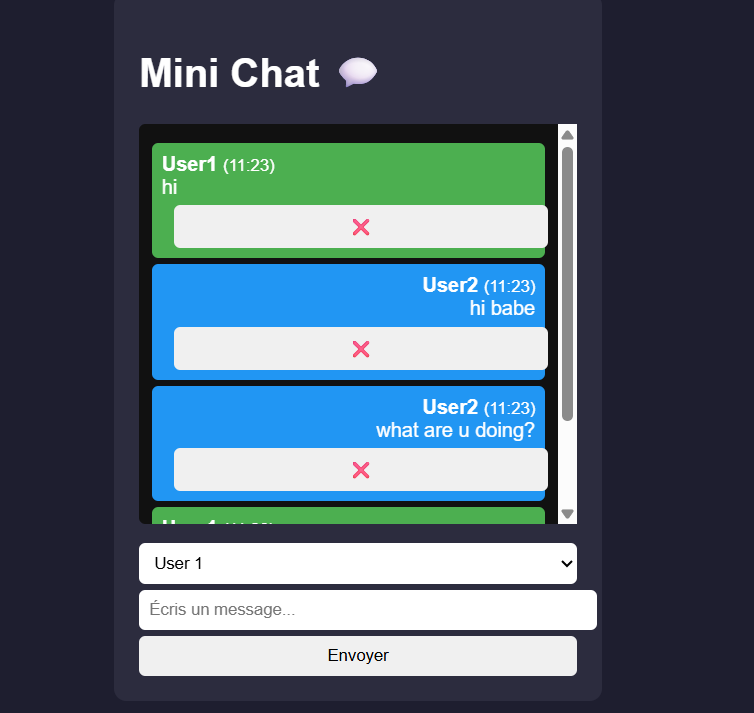

# 💬 Mini Chat en JavaScript

Un mini projet frontend qui simule une application de chat entre deux utilisateurs directement dans le navigateur, sans backend.

---

## 🚀 Objectif du projet

Ce projet a pour but de :

- Pratiquer JavaScript (DOM, événements, logique)
- Comprendre le stockage local (`localStorage`)
- Structurer un mini projet frontend proprement
- Simuler une application réelle (chat)

---

## 🧩 Fonctionnalités

- ✅ Envoyer des messages
- ✅ Choisir un utilisateur (User1 / User2)
- ✅ Afficher les messages en temps réel
- ✅ Horodatage des messages
- ✅ Suppression d’un message
- ✅ Sauvegarde des messages (localStorage)
- ✅ Persistance après rafraîchissement
- ✅ Envoi avec la touche **Entrée**
- ✅ Scroll automatique

---

## 🛠️ Technologies utilisées

- HTML5
- CSS3
- JavaScript (Vanilla JS)

---

## 📁 Structure du projet


mini-chat/
│
├── index.html
├── style.css
├── script.js
└── README.md


---

## ⚙️ Installation

1. Cloner le projet :

```bash
git clone https://github.com/ton-username/mini-chat.git
Ouvrir le projet :
cd mini-chat
Lancer le projet :

👉 Ouvre simplement le fichier index.html dans ton navigateur.

💾 Fonctionnement du stockage

Les messages sont stockés dans le navigateur via :

localStorage.setItem("messages", JSON.stringify(messages));

Cela permet de conserver les messages même après un rafraîchissement de la page.

🧠 Logique principale
    Les messages sont stockés dans un tableau messages[]
    Chaque message contient :
    {
    user: "User1",
    text: "Hello",
    time: "14:32"
    }

À chaque ajout :
    Mise à jour du tableau
    Sauvegarde dans localStorage
    Réaffichage des messages

🧪 Améliorations possibles
🔥 Niveau 1
    Ajouter un bouton "Vider le chat"
    Ajouter des avatars utilisateurs
    Améliorer le design (UI moderne)

🔥🔥 Niveau 2
    Ajouter une réponse automatique (bot)
    Ajouter des animations
    Dark / Light mode

🔥🔥🔥 Niveau 3
    Synchronisation entre plusieurs onglets
    Ajout d’un backend (Node.js + Socket.io)
    Authentification utilisateur
    
📸 Aperçu



📌 À propos

Ce projet est idéal pour :

    Débutants en JavaScript
    Création de portfolio
    Révision des bases frontend

