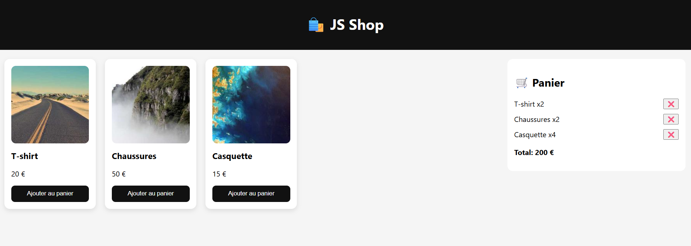

# 🛍️ Mini E-commerce en JavaScript (Vanilla JS)

## 📌 Description

Ce projet est une application de **mini e-commerce frontend** développée en **JavaScript pur (Vanilla JS)**, sans framework ni backend.


L'objectif est de simuler une expérience d'achat simple :

* afficher des produits
* ajouter au panier
* gérer les quantités
* calculer le total
* persister les données avec le `localStorage`

---

## 🚀 Fonctionnalités

* 🛒 Affichage dynamique des produits
* ➕ Ajout au panier
* ❌ Suppression d’un produit
* 🔢 Gestion des quantités
* 💰 Calcul du total en temps réel
* 💾 Sauvegarde du panier avec `localStorage`
* 🎨 Interface moderne (HTML + CSS)

---

## 🧱 Stack technique

* HTML5
* CSS3 (Flexbox / Grid)
* JavaScript (ES6)
* DOM Manipulation
* Web Storage API (`localStorage`)

---

## 📁 Structure du projet

```
/ecommerce-js
  ├── index.html
  ├── style.css
  ├── script.js
  └── /images
        ├── tshirt.jpg
        ├── shoes.jpg
        └── cap.jpg
```

---

## ⚙️ Installation & utilisation

1. Cloner le projet :

```bash
git clone https://github.com/ton-username/ecommerce-js.git
```

2. Ouvrir le fichier :

```bash
index.html
```

👉 Aucun serveur requis (100% frontend)

---

## 🧠 Logique principale

### Gestion du panier

Le panier est stocké sous forme de tableau d’objets :

```js
{
  id: number,
  name: string,
  price: number,
  quantity: number
}
```

### Persistance des données

Utilisation de :

```js
localStorage.setItem("cart", JSON.stringify(cart));
```

---

## 🎯 Objectifs pédagogiques

Ce projet permet de maîtriser :

* la manipulation du DOM
* la gestion d’état côté frontend
* les événements JavaScript
* la logique CRUD
* la persistance côté navigateur

---

## 🔥 Améliorations possibles

* 🔍 Barre de recherche
* 🧮 Gestion des quantités (+ / -)
* 🗑️ Vider le panier
* 🖼️ Intégration d’API images (Unsplash)
* 📱 Responsive design
* 💳 Simulation de paiement
* 🧩 Refactorisation en modules JS

---

## 📢 Publication LinkedIn (idée)

> J’ai développé un mini projet e-commerce en JavaScript pur pour renforcer mes compétences frontend : gestion du DOM, logique panier, localStorage…
>
> 🔗 Code disponible ici : [lien du repo]

---


## ⭐ Conclusion

Un projet simple mais essentiel pour comprendre les bases du développement frontend et poser les fondations pour des applications plus complexes (React, Vue, etc.).
