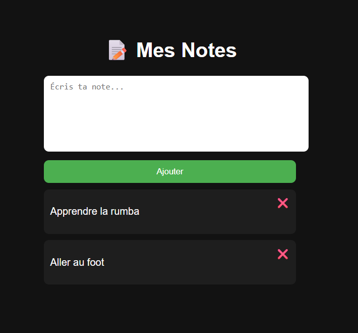

📝 Notes App (JavaScript)
📌 Description

Une application web simple de prise de notes développée en JavaScript vanilla, permettant d’ajouter, afficher et supprimer des notes avec persistance via le localStorage.

Ce projet a pour objectif de pratiquer :

la manipulation du DOM
    la gestion des événements
    le stockage côté client
    🚀 Fonctionnalités
    ➕ Ajouter une note
    📄 Afficher toutes les notes
    ❌ Supprimer une note
    💾 Sauvegarde automatique dans le navigateur (localStorage)

🛠️ Technologies utilisées
    HTML5
    CSS3
    JavaScript (Vanilla)
    Web Storage API (localStorage)

📂 Structure du projet
/
├── index.html      # Structure de l'application
├── style.css       # Design et mise en page
└── script.js       # Logique JavaScript

⚙️ Installation et utilisation
    Clone le projet ou télécharge les fichiers :
    git clone <url-du-repo>
    Ouvre le fichier index.html dans ton navigateur :
    double clique sur index.html

Aucune dépendance ou installation supplémentaire requise.

🧠 Fonctionnement technique
    Les notes sont stockées dans un tableau JavaScript
    Ce tableau est synchronisé avec localStorage via :
    JSON.stringify() pour sauvegarder
    JSON.parse() pour récupérer
    Le DOM est mis à jour dynamiquement à chaque modification

🔄 Cycle de vie d'une note
    Utilisateur écrit une note
            ↓
    Clic sur "Ajouter"
            ↓
    Ajout dans le tableau JS
            ↓
    Sauvegarde dans localStorage
            ↓
    Affichage dynamique dans le DOM

📈 Améliorations possibles
    Niveau intermédiaire
    ✏️ Modifier une note
    📅 Ajouter une date
    🔍 Recherche de notes

Niveau avancé
    🗂️ Filtrage (récentes / anciennes)
    🌙 Mode sombre / clair
    📦 Export des notes en JSON

Niveau expert
    🔄 Drag & Drop des notes
    ⚛️ Migration vers React
    ☁️ Sauvegarde via API (backend)

🐛 Limitations actuelles
    Pas d’édition des notes
    Pas de gestion multi-utilisateurs
    Stockage limité au navigateur

📸 Aperçu

📄 Licence

Ce projet est libre d’utilisation pour un usage personnel ou pédagogique.

✍️ Auteur

Projet réalisé dans le cadre d’apprentissage JavaScript.