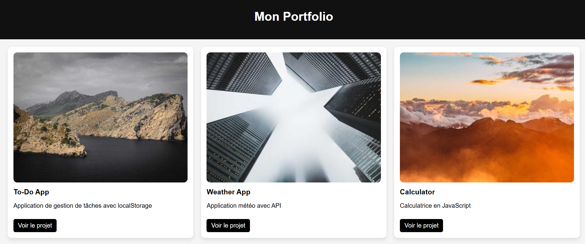

# 🚀 Portfolio Dynamique en JavaScript

## 📌 Description

Ce projet est un **portfolio dynamique développé en JavaScript vanilla**.
Les projets sont chargés depuis un fichier JSON externe, ce qui permet de **séparer les données de la logique** et de rendre le site facilement maintenable et évolutif.

---

## 🎯 Objectifs du projet

* Manipuler le DOM dynamiquement
* Utiliser `fetch()` pour charger des données
* Structurer un projet frontend proprement
* Séparer contenu (JSON) et logique (JS)
* Créer une base de portfolio réutilisable

---

## 🛠️ Technologies utilisées

* HTML5
* CSS3 (Grid, responsive)
* JavaScript (ES6+)
* JSON (simulation d’API)

---

## ⚙️ Fonctionnalités

* 📂 Chargement dynamique des projets via `projects.json`
* 🧩 Génération automatique des cartes projets
* 🖼️ Affichage image + titre + description + lien
* 📱 Design responsive avec CSS Grid
* 🔗 Redirection vers les projets

---

## 📁 Structure du projet

```
portfolio/
│
├── index.html
├── style.css
├── app.js
└── projects.json
```

---

## 🚀 Installation & utilisation

1. Cloner le repo :

```
git clone https://github.com/ton-username/portfolio-js.git
```

2. Ouvrir le projet avec un serveur local :

👉 Recommandé : VS Code + Live Server

3. Lancer le projet :

```
http://127.0.0.1:5500/
```

---

## 🧠 Ce que j’ai appris

* Utilisation de `fetch()` pour récupérer des données
* Manipulation du DOM (`createElement`, `innerHTML`)
* Gestion des erreurs avec `.catch()`
* Structuration d’un projet frontend
* Importance d’un serveur local

---

## 🔥 Améliorations possibles

* 🔍 Barre de recherche
* 🏷️ Filtrage par catégories
* 🌙 Mode sombre
* 🎨 Animations CSS
* 🔗 Connexion à une vraie API (ex: GitHub API)
* ⚡ Optimisation des performances (lazy loading)

---

## 📸 Aperçu

*


---

## ⭐ Conclusion

Ce projet constitue une **base solide pour un portfolio moderne** et peut être facilement enrichi avec des fonctionnalités avancées.

---
