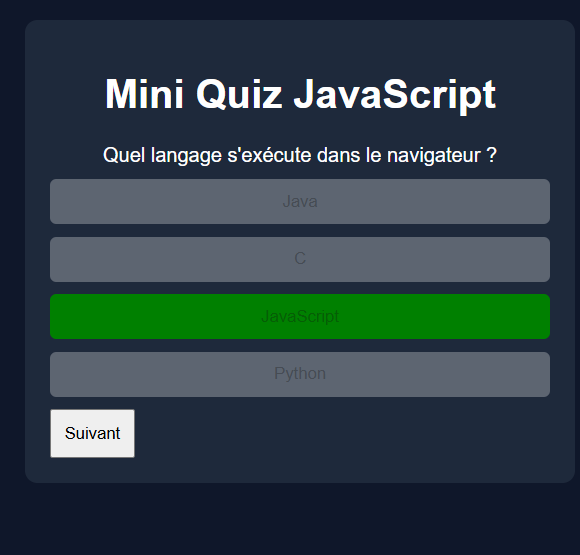

📚 Mini Quiz JavaScript
🧩 Description

Mini application web interactive développée en JavaScript vanilla permettant de tester ses connaissances via un système de quiz.

L’utilisateur répond à une série de questions à choix multiple et obtient un score final à la fin du quiz.

🚀 Fonctionnalités
    Affichage dynamique des questions
    Choix multiple avec feedback visuel (bonne / mauvaise réponse)
    Désactivation des réponses après sélection
    Navigation entre les questions
    Calcul et affichage du score final

🛠️ Technologies utilisées
    HTML5
    CSS3
    JavaScript (Vanilla JS)

📁 Structure du projet
    mini-quiz/
    │── index.html
    │── style.css
    │── script.js
    ⚙️ Installation & utilisation
    Cloner le projet :
    git clone https://github.com/ton-username/mini-quiz.git
    Ouvrir le fichier :
    index.html

👉 Aucun serveur nécessaire, fonctionne directement dans le navigateur.

🧠 Fonctionnement
1. Structure des données

    Les questions sont stockées dans un tableau d’objets :

    {
    question: "Question ici",
    answers: [
        { text: "Réponse 1", correct: true },
        { text: "Réponse 2", correct: false }
    ]
    }
    2. Logique principale
    showQuestion() → affiche une question
    selectAnswer() → gère la sélection d’une réponse
    showScore() → affiche le score final

📸 Aperçu

    Interface simple et responsive
    Boutons interactifs
Feedback visuel immédiat

    🔥 Améliorations possibles
    🔄 Bouton "Rejouer"
    ⏱️ Timer par question
    📊 Barre de progression
    🌐 Récupération des questions via une API
    🎨 Amélioration du design (animations, UI moderne)
    🎯 Objectifs pédagogiques

Ce projet permet de maîtriser :

    Manipulation du DOM
    Gestion des événements (addEventListener)
    Logique conditionnelle
    Structures de données en JavaScript
    Gestion d’état (score, progression)