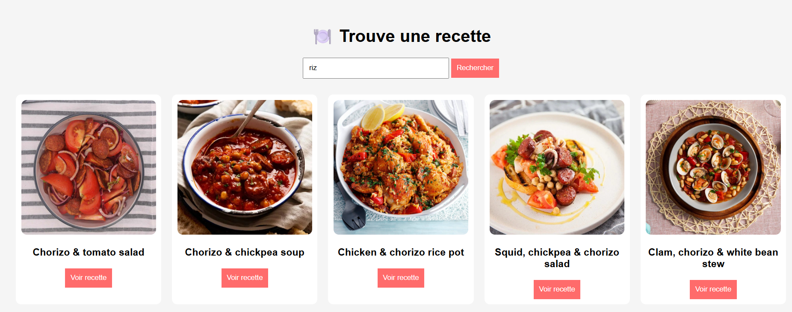

🍽️ # Recipe Finder App (JavaScript)
    ## Description

    Recipe Finder est une application web simple développée en JavaScript vanilla qui permet de rechercher des recettes en temps réel via une API externe.

L’utilisateur peut :

    Rechercher une recette par mot-clé (ex : chicken, pasta…)
    Visualiser une liste de résultats

Consulter les détails d’une recette (catégorie, origine, instructions)
🚀 Fonctionnalités
    🔍 Recherche dynamique de recettes
    🌐 Intégration API REST (TheMealDB)
    ⏳ Loader pendant le chargement
    ⌨️ Recherche avec la touche Entrée
    📄 Affichage détaillé d’une recette
    🔙 Navigation (retour aux résultats)
    ❌ Gestion des erreurs (API / réseau)

🧱 Stack technique
    HTML5
    CSS3
    JavaScript (ES6+)
    Fetch API (async/await)

📁 Structure du projet
    recipe-app/
    │── index.html
    │── style.css
    │── script.js

⚙️ Installation
    Cloner le projet :
    git clone https://github.com/ton-username/recipe-app.git
    Ouvrir le fichier :
    index.html

    👉 Aucun serveur requis (fonctionne en local)

    🌐 API utilisée
    TheMealDB
    Documentation : https://www.themealdb.com/api.php

    Exemple endpoint :

    https://www.themealdb.com/api/json/v1/1/search.php?s=chicken

🧠 Fonctionnement technique
    1. Récupération des données

    Utilisation de fetch() avec async/await pour appeler l’API.

    2. Manipulation du DOM

    Création dynamique de cartes recettes avec createElement.

    3. Gestion des événements
    Click bouton
    Touche Enter
    Boutons “Voir recette”
    4. Navigation

Remplacement dynamique du contenu pour afficher les détails.

🔥 Améliorations possibles
    🎨 UI/UX améliorée (design moderne)
    🪟 Modal pour afficher les recettes
    🧾 Affichage des ingrédients dynamiques
    ❤️ Système de favoris (localStorage)
    📱 Responsive mobile avancé
    ⚛️ Migration vers React / Next.js
    📈 Objectif pédagogique

Ce projet permet de maîtriser :

    les appels API
    la gestion asynchrone en JavaScript
    la manipulation du DOM
    la structuration d’un projet frontend

📄 Licence

Projet libre d’utilisation à des fins éducatives