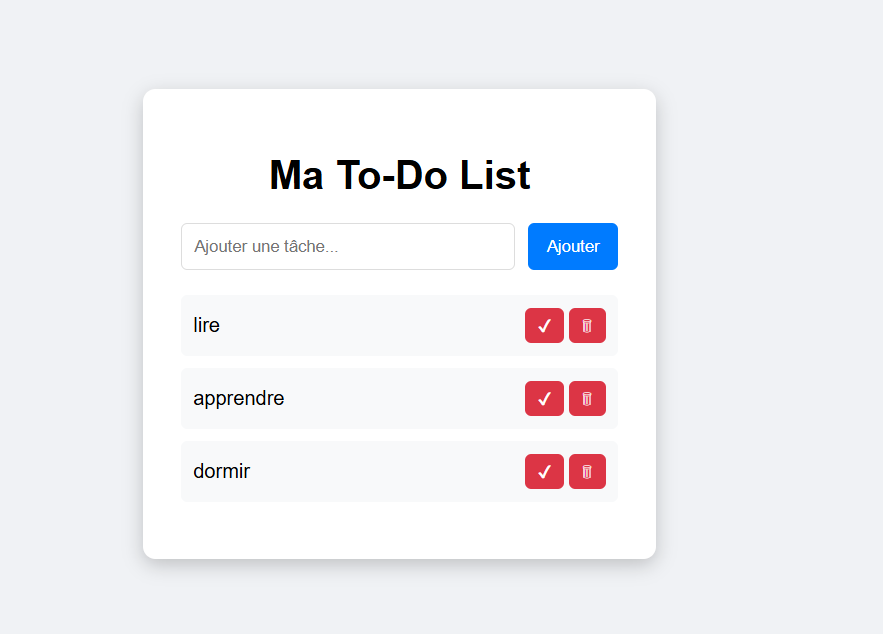

📌 To-Do List en JavaScript

📖 Description

Cette application est une To-Do List simple développée en JavaScript vanilla.
Elle permet de gérer des tâches quotidiennes avec persistance des données grâce au localStorage.

🚀 Fonctionnalités
    ➕ Ajouter une tâche
    ✅ Marquer une tâche comme terminée
    🗑 Supprimer une tâche
    💾 Sauvegarde automatique dans le navigateur (localStorage)
    🔄 Récupération des tâches après rechargement de la page

🛠️ Technologies utilisées
    HTML5
    CSS3
    JavaScript (Vanilla JS)
    localStorage API

📂 Structure du projet
    todo-list/
    │── index.html
    │── style.css
    │── script.js

⚙️ Installation et utilisation
Clone le projet :
    git clone https://github.com/ton-username/todo-list.git

Ouvre le fichier :
    index.html
    Utilise l'application directement dans ton navigateur 🚀

🧠 Fonctionnement technique
    Les tâches sont stockées dans un tableau JavaScript :
    let todos = [];
    Chaque tâche est un objet :
    {
    text: "Faire du sport",
    done: false
    }

Sauvegarde dans le localStorage :
    localStorage.setItem('todos', JSON.stringify(todos));
    Récupération :
    JSON.parse(localStorage.getItem('todos'));

📸 Aperçu

🔥 Améliorations possibles
    ✏️ Modifier une tâche
    🎯 Ajouter des catégories
    📅 Ajouter une date limite
    🎨 Améliorer le design (Dark mode)
    🔀 Drag & Drop pour réorganiser les tâches
    🔔 Notifications