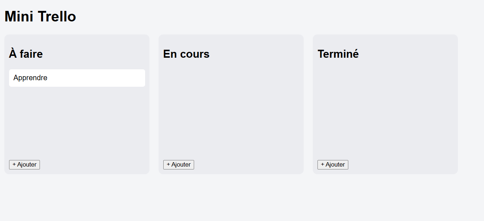

📌 Mini Trello Clone (JavaScript)
🧠 Description

Ce projet est une application web de gestion de tâches inspirée de Trello.
Il permet de créer, organiser et déplacer des tâches entre différentes colonnes grâce au drag & drop.

👉 Objectif : pratiquer JavaScript en conditions réelles (DOM, événements, stockage local).

🚀 Fonctionnalités
    ➕ Ajouter une tâche
    📦 Organiser les tâches en colonnes :
    À faire
    En cours
    Terminé
    🖱️ Glisser-déposer les tâches (Drag & Drop)
    💾 Sauvegarde automatique avec localStorage
    🔄 Rechargement des données au refresh

🛠️ Technologies utilisées
    HTML5
    CSS3
    JavaScript (Vanilla JS)

📂 Structure du projet
    trello-clone/
    │── index.html
    │── style.css
    │── script.js
    ⚙️ Installation
    Clone le projet :
    git clone https://github.com/ton-username/trello-clone.git
    Ouvre le fichier :
    index.html

👉 Aucun serveur nécessaire (projet 100% frontend)

🧪 Utilisation
    Clique sur "+ Ajouter"
    Entre le nom de la tâche
    Glisse la tâche vers une autre colonne
    Les données sont sauvegardées automatiquement

🔥 Améliorations possibles
    ❌ Supprimer une tâche
    ✏️ Modifier une tâche
    ➕ Ajouter/supprimer des colonnes
    🎯 Drag & drop avancé (position précise)
    📱 Responsive mobile
    🎨 UI moderne (design type SaaS)

📚 Compétences développées
    Manipulation du DOM
    Gestion des événements (drag & drop)
    Stockage local (localStorage)
    Structuration d’un projet frontend

⭐ Contribution

Les contributions sont les bienvenues !
N’hésite pas à fork le projet et proposer des améliorations.